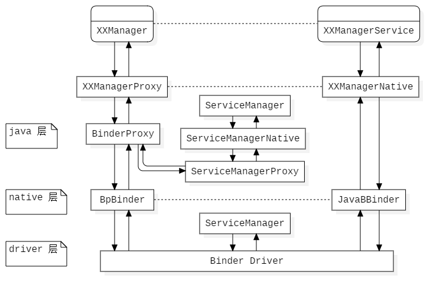
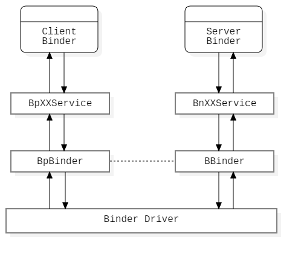

# Android Binder 的设计、实现与应用 - 文档概要

- [前言](#前言)
- [Binder 概要](#binder-概要)
- [Binder 架构](#binder-架构)
  - [Java 层](#java-层)
  - [Native 层](#native-层)
  - [Driver 层](#driver-层)
- [Binder 框架应用](#binder-框架应用)
  - [文档列表](#文档列表)
- [其他](#其他)

## 前言

Binder 是 Android 系统中的主要进程间通信方式，如果要深入理解 Android 系统各部分的实现原理，各个系统服务的功能实现，Binder 框架的设计实现以及应用是必须首先学习的，只有跨过这道栏杆才能顺利的学习 Android 系统原理。

Android Binder 的设计、实现与应用一系列的文档记录了个人 Binder 学习以及分析过程。

## Binder 概要

Binder 是 Android 系统中的进程间通信方式之一，Binder 定义的整个进程间通信框架贯穿了 Android 系统的底层到上层，如果要深入理解 Binder 原理，那么必须对每个层次的 Binder 架构进行分析。

下面简述每个层次的 Binder 职责：

- 应用层，为应用程序提供进程间通信服务，可使用 aidl 描述语言定义远程服务之间的 Binder 通信接口，并实现面向对象的进程间通信。
- java 层，为 Framework java 层服务提供进程间通信服务，例如 AMS，PMS 等服务。
- native 层，为 Framework native 层的服务提供进程间通信，例如 MediaPlayerService 服务；管理 native 层服务的注册获取，native 层实现了 Binder 服务注册统一管理者 ServiceManager。
- driver 层，为 Binder 核心通信方法的实现，以驱动的形式存在于 Android 系统中。

## Binder 架构

通过分析参与 Binder 通信的相关服务对于 Binder 框架每一层的实现，描述每个层次的架构以及绘制图形。

### Java 层

java 层 Binder 框架是 native 的一个映射，所以和 native 框架很类似，客户端和服务端都有其对应的代理对象。

- XXManager 为服务端提供给用户的客户端接口，为用户提供真实服务端所需的服务，与服务端接口保持一致，例如 `ActivityManager`。
- XXManagerProxy 是客户端的代理，负责处理用户向客户端的提出的服务请求，将数据打包发送至服务端。
- BinderProxy 是客户端 Binder 的在 java 层的表示，它是 native 层 BpBinder 的映射类型。
- JavaBBinder 是 java 层服务端在 native 层的表示，同时也是服务端 Binder 的表示，它是一个 BBinder 类型。
- XXManagerNative 是服务端的代理，负责处理客户端向服务端发送的请求，解析数据包转发给服务端处理。
- XXManagerService 是服务端的实现类，为用户提供具体的服务。

### Native 层

- `BpXXService` 是客户端的代理类型，负责与服务的交互，隐藏数据包的收发细节，使客户端专注于自身的客户端逻辑。
- `BpBinder` 表示客户端 Binder 对象，内部封装了服务端 Binder 引用号和向驱动发送数据的交互细节。
- `Binder Driver` 驱动实现进程间通信的核心功能（利用共享内存），管理 Binder 实体和对应的 Binder 引用。
- `BBinder` 表示服务端 Binder 对象，抽象了 `onTransact` 函数。
- `BnXXService` 使服务端的代理类型，服务处理客户端的数据包，它隐藏了数据包的收发细节，使服务端专注于自身的业务逻辑。

### Driver 层

[todo]

## Binder 框架应用

[todo]

### 文档列表

下面将几份文档分析每个层次的实现：

- Binder 设计

[Android Binder 的设计、实现与应用 - Binder 设计分析](./android_binder_design.md)

- Binder native 层实现

[Android Binder 的设计、实现与应用 - Native 层实现分析](./android_binder_implement_native.md)

[Android Binder 的设计、实现与应用 - Native 层 Client-Server 通信分析](./android_binder_implement_native_cs.md)

- Binder java 层实现

[Android Binder 的设计、实现与应用 - Java 层实现分析](./android_binder_implement_java.md)

- Binder driver 层实现

[todo]

## 其他

分析使用了 Android 6.0.1 系统的源码， 首先 Android 6.0 是市面上目前相对比较主流的系统版本，拥有动态权限申请等诸多新特性，其次在其源码分析的了解之上向较旧或较新的系统版本上延伸了解都不至于太费力。

参考下资料（按照参考顺序排序）：

> - [Android Bander 设计与实现 - 设计篇](https://blog.csdn.net/universus/article/details/6211589) - universus
> - 《深入理解 Android 卷 1》 - 邓凡平
> - 《深入理解 Android 卷 2》 - 邓凡平
> - [Android 深入浅出之 Binder 机制](https://www.cnblogs.com/innost/archive/2011/01/09/1931456.html) - innost (邓凡平)
> - [Binder 系列](http://gityuan.com/2015/10/31/binder-prepare/) - Gityuan (袁辉辉)