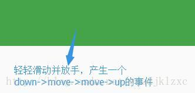
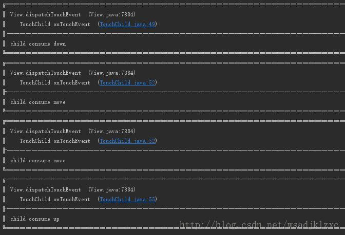
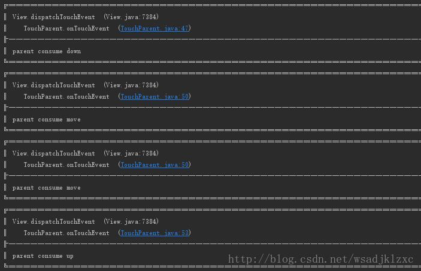
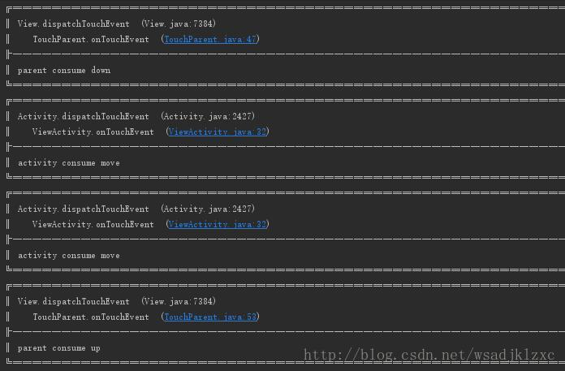
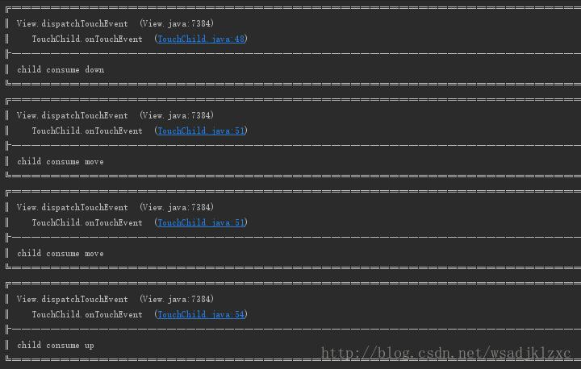
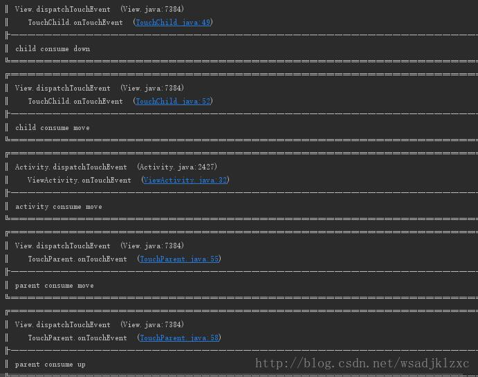
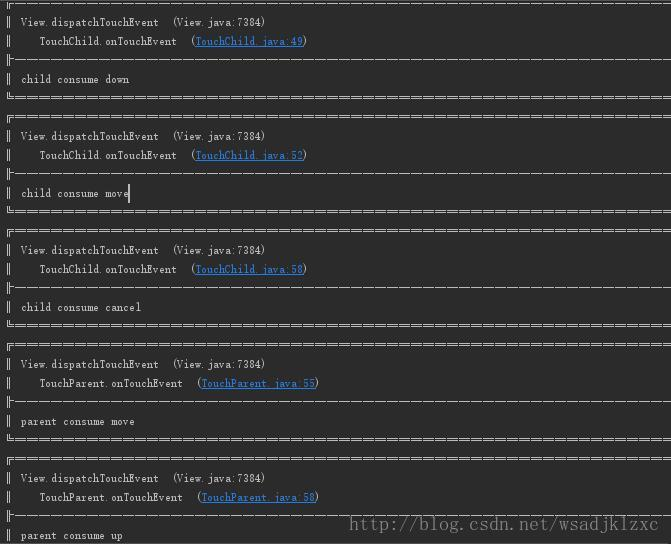
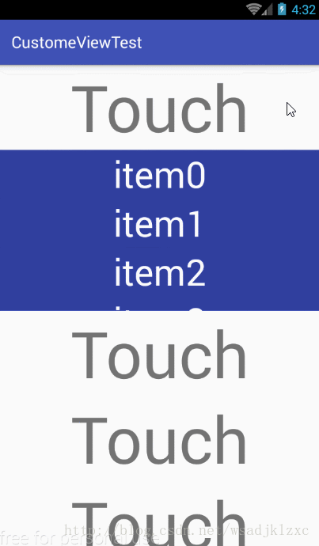
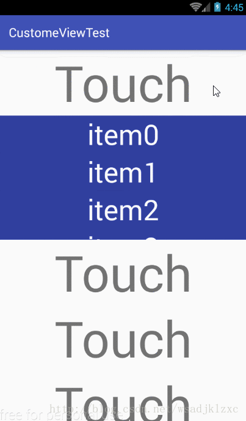

# Android View事件分发机制

* [触摸事件处理框架](#触摸事件处理框架)
  * [核心方法](#核心方法)
  * [调用关系](#调用关系)
  * [触摸事件流向](#触摸事件流向)
* [部分方法的默认实现](#部分方法的默认实现)
  * [Activity-dispatchTouchEvent](#activity-dispatchtouchevent)
  * [ViewGroup-onInterceptTouchEvent](#viewgroup-onintercepttouchevent)
  * [View-dispatchTouchEvent](#view-dispatchtouchevent)
  * [View-onTouchEvent](#view-ontouchevent)
* [ViewGroup-dispatchTouchEvent 分析](#viewgroup-dispatchtouchevent-分析)
* [结论](#结论)
* [编码验证](#编码验证)
* [触摸事件冲突处理](#触摸事件冲突处理)
  * [外部拦截法](#外部拦截法)
  * [内部拦截法](#内部拦截法)
* [事件冲突处理实例](#事件冲突处理实例)

## 触摸事件处理框架

Android 的 View 和 ViewGroup 采用了 Composite(组合) 设计模式，View 的组合具有高度动态性，在这种情况下，由于触摸事件是从底层驱动传递至上层 View 对象，如果按照普通对象间传递信息的方式，将会很复杂，很难处理，这里 Android 采用了 Chain of Responsibility(责任链) 设计模式，触摸事件流将通过视图树，使每个 View 对象都有机会处理事件，一旦某个 View 选择接收事件流，那么整个事件将交给它处理，如果 View 选择不处理，那么事件流会继续传递，直到找到最后的处理者，在处理触摸事件时有几个重要的方法，在弄懂 Android 事件分发机制之前，需要先了解这几个方法的作用及关系。

### 核心方法

- ViewGroup 的三个重载方法

> `boolean dispatchEvent(MotionEvent e)` 当触摸事件传递给当前 View 或 ViewGroup时，此方法将会被调用，它会负责事件的分发工作，可能会将事件交给自己的 `onTouchEvent` 方法或子View来处理，返回值为是否消耗事件
>
> `boolean onIntercepteEvent(MotionEvent e)` 此方法将被 `dispatchEvent` 方法调用，返回的是是否拦截此次事件，如果返回 true，事件将被拦截，事件交给自己的 `onTouchEvent` 处理，子 view 将不能接收到事件，否则交给子view处理，但子 view 可以通过一个方法设置一个标记来阻止事件的拦截。
>
> `boolean onTouchEvent(MotionEvent e)` 负责消耗触摸事件，一般在此处处理触摸事件，返回值为是否消耗事件，若不消耗事件，事件将不会再次被传递，而是交给上层 View 进行处理

- View 中存在两个方法，作用和 ViewGroup 相似

> `boolean dispatchEvent(MotionEvent e)` 作用和 viewgroup 类似，由于 view 一定会处理事件，所以 view 不存在 `onIntercepteEvent` 这个方法，因此 `dispatchEvent` 最终会将事件交给 `onTouchEvent` 方法处理
>
> `boolean onTouchEvent(MotionEvent e)` 与 ViewGroup 作用相同

### 调用关系

上面介绍了每个方法的作用，下面用伪代码来描述他们的大致关系

```java
/* 事件交给 viewGroup 的 dispatchTouchEvent 进行处理 */
public boolean dispatchTouchEvent(MotionEvent event) {
  boolean consume = false;
  if (onIntercepteEvent(event)) {
    /* 决定拦截，事件将交给自己处理 */
    consume = onTouchEvent(event);
  } else {
    /* 否则交给子view或viewGroup继续分发事件 */
    consume = touchTarget.dispatchTouchEvent();
  }
  return consume;
}
```

上面的伪代码将事件处理模型描述了出来，事件总体是按照这个方式处理的，但涉及到 DOWN，MOVE 等具体事件时还需要详细探讨

### 触摸事件流向

上面介绍了触摸事件处理结构，下面介绍当一个触摸事件产生时，触摸事件的传递方向，当触摸屏幕产生触摸事件时，事件将会首先到达顶层 Activity 并交给它的 `dispatchTouchEvent` 方法来处理，虽然 Activity 不是 View，但它同样具有 `dispatchTouchEvent`和 `onTouchEvent` 方法，`dispatchTouchEvent` 会辗转调用顶层 View 的 `dispatchTouchEvent` 方法，并传递触摸事件，即开始按照上面伪代码描述的流程来传递事件，如果顶层 View 的 `dispatchTouchEvent` 返回 `false` 即事件没有被消耗，则会最终交给 Activity 自身的 `onTouchEvent` 方法处理

## 部分方法内部实现                                 

在遇到事件冲突问题时，通常需要在自定义的 ViewGroup 或 View 中重写部分事件处理方法改变部分原有规则。

### Activity-dispatchTouchEvent

可以看到 Activity 的 `dispatchTouchEvent` 的处理，就是之前所描述的

```java
public boolean dispatchTouchEvent(MotionEvent ev) {
  if (ev.getAction() == MotionEvent.ACTION_DOWN) {
    onUserInteraction();
  }
  // Window 对象将会把事件传递给顶层 view(DecorView)
  if (getWindow().superDispatchTouchEvent(ev)) {
    return true;
  }
  // 否则交给自己
  return onTouchEvent(ev);
 }
```

### View-dispatchTouchEvent

View 的 dispatchEventEvent 方法，当 OnTouchListener 未处理事件，事件将交给 onTouchEvent 处理。 

```java
public boolean dispatchTouchEvent(MotionEvent event) {
    ...
    boolean result = false;
    if (mInputEventConsistencyVerifier != null) {
        mInputEventConsistencyVerifier.onTouchEvent(event, 0);
    }
    final int actionMasked = event.getActionMasked();
    if (actionMasked == MotionEvent.ACTION_DOWN) {
        stopNestedScroll();
    }
    if (onFilterTouchEventForSecurity(event)) { // 安全条件过滤后的事件
        if ((mViewFlags & ENABLED_MASK) == ENABLED && handleScrollBarDragging(event)) {
            result = true; // 处理滚动条
        }
      	// 如果 view 设置了 onTouchListener 并且它消耗了事件，
      	// 那么view 的 onTouchEvent 方法将不会再回调
        ListenerInfo li = mListenerInfo;
        if (li != null && li.mOnTouchListener != null
                && (mViewFlags & ENABLED_MASK) == ENABLED
                && li.mOnTouchListener.onTouch(this, event)) {
            result = true;
        }
        if (!result && onTouchEvent(event)) {
            result = true;
        }
    }
    if (actionMasked == MotionEvent.ACTION_UP || 
        actionMasked == MotionEvent.ACTION_CANCEL || 
        (actionMasked == MotionEvent.ACTION_DOWN && !result)) {
        stopNestedScroll();
    }
    return result;
}
```

### Viewgroup-onInterceptTouchEvent

ViewGroup 的 `onInterceptTouchEvent` 的方法实现，

```java
public boolean onInterceptTouchEvent(MotionEvent ev) {
    if (ev.isFromSource(InputDevice.SOURCE_MOUSE)
        && ev.getAction() == MotionEvent.ACTION_DOWN
        && ev.isButtonPressed(MotionEvent.BUTTON_PRIMARY)
        && isOnScrollbarThumb(ev.getX(), ev.getY())) {
      	return true;
    }
    return false;
}
```

常用的几个布局,包括 LiearnLayout，RelativeLayout，FrameLayout，都没有重写 `onInterceptTouchEvent` 方法，使用的都是ViewGroup的实现，只有在手指或者鼠标触摸时返回 true 选择拦截事件，其他情况都返回  false，不拦截事件，事件将交给子view处理，当需要拦截事件交给ViewGroup处理的时候，可以重写这个方法，改变它默认的规则。

### View-onTouchEvent

ViewGroup 和 View 使用相同的 `onTouchEvent` 方法实现，可以看出 View 默认实现了点击事件的处理，对于设置了 DISABLE 属性的 view，如果设置了可点击，例如 `CLICKABLE` 或 `LONGCLICKABLE` 属性，则会消耗事件，

```java
public boolean onTouchEvent(MotionEvent event) {
    final float x = event.getX();
    final float y = event.getY();
    final int viewFlags = mViewFlags;
    final int action = event.getAction();
  	// 当控件为 DISABLED 状态时，如果设置了点击属性，依然会消耗事件
    if ((viewFlags & ENABLED_MASK) == DISABLED) {
        if (action == MotionEvent.ACTION_UP && (mPrivateFlags & PFLAG_PRESSED) != 0) {
            setPressed(false);
        }
        return (((viewFlags & CLICKABLE) == CLICKABLE
                || (viewFlags & LONG_CLICKABLE) == LONG_CLICKABLE)
                || (viewFlags & CONTEXT_CLICKABLE) == CONTEXT_CLICKABLE);
    }
  	// 类似 onTouchListener
    if (mTouchDelegate != null) {
        if (mTouchDelegate.onTouchEvent(event)) {
            return true;
        }
    }
  	// 处理点击事件
    if (((viewFlags & CLICKABLE) == CLICKABLE ||
            (viewFlags & LONG_CLICKABLE) == LONG_CLICKABLE) ||
            (viewFlags & CONTEXT_CLICKABLE) == CONTEXT_CLICKABLE) {
        switch (action) {
            case MotionEvent.ACTION_UP:
                boolean prepressed = (mPrivateFlags & PFLAG_PREPRESSED) != 0;
                if ((mPrivateFlags & PFLAG_PRESSED) != 0 || prepressed) {
                    boolean focusTaken = false;
                    if (isFocusable() && isFocusableInTouchMode() && !isFocused()) {
                        focusTaken = requestFocus();
                    }
                    if (prepressed) {
                        setPressed(true, x, y);
                   }
                    if (!mHasPerformedLongPress && !mIgnoreNextUpEvent) {
                        removeLongPressCallback();
                        if (!focusTaken) {
                            if (mPerformClick == null) {
                                mPerformClick = new PerformClick();
                            }
                            if (!post(mPerformClick)) {
                                performClick();
                            }
                        }
                    }
                    if (mUnsetPressedState == null) {
                        mUnsetPressedState = new UnsetPressedState();
                    }
                    if (prepressed) {
                        postDelayed(mUnsetPressedState,
                                ViewConfiguration.getPressedStateDuration());
                    } else if (!post(mUnsetPressedState)) {
                        mUnsetPressedState.run();
                    }
                    removeTapCallback();
                }
                mIgnoreNextUpEvent = false;
                break;
            case MotionEvent.ACTION_DOWN:
                mHasPerformedLongPress = false;
                if (performButtonActionOnTouchDown(event)) {
                    break;
                }
                boolean isInScrollingContainer = isInScrollingContainer();
                if (isInScrollingContainer) {
                    mPrivateFlags |= PFLAG_PREPRESSED;
                    if (mPendingCheckForTap == null) {
                        mPendingCheckForTap = new CheckForTap();
                    }
                    mPendingCheckForTap.x = event.getX();
                    mPendingCheckForTap.y = event.getY();
                    postDelayed(mPendingCheckForTap, ViewConfiguration.getTapTimeout());
                } else {
                    setPressed(true, x, y);
                    checkForLongClick(0, x, y);
                }
                break;
            case MotionEvent.ACTION_CANCEL:
                setPressed(false);
                removeTapCallback();
                removeLongPressCallback();
                mInContextButtonPress = false;
                mHasPerformedLongPress = false;
                mIgnoreNextUpEvent = false;
                break;
            case MotionEvent.ACTION_MOVE:
                drawableHotspotChanged(x, y);
                if (!pointInView(x, y, mTouchSlop)) {
                    removeTapCallback();
                    if ((mPrivateFlags & PFLAG_PRESSED) != 0) {
                        removeLongPressCallback();
                        setPressed(false);
                    }
                }
                break;
        }
        return true;
    }
    return false;
}
```

## ViewGroup-dispatchTouchEvent 分析

上面是事件分发的流程和参与事件分发的部分方法实现，最后对 ViewGroup 的 dispatchTouchEvent 方法进行分析，它是事件分发机制的核心实现。

```java
@Override
public boolean dispatchTouchEvent(MotionEvent ev) {
  if (mInputEventConsistencyVerifier != null) {
    mInputEventConsistencyVerifier.onTouchEvent(ev, 1);
  }

  if (ev.isTargetAccessibilityFocus() && isAccessibilityFocusedViewOrHost()) {
    ev.setTargetAccessibilityFocus(false);
  }

  boolean handled = false;
  if (onFilterTouchEventForSecurity(ev)) {
    final int action = ev.getAction();
    final int actionMasked = action & MotionEvent.ACTION_MASK;

    // ------------------------------------------------ part 1 

    /* 在 DOWN事件(事件序列开始) 发生时初始化 */
    if (actionMasked == MotionEvent.ACTION_DOWN) {
      /* 清空 mFirstTouchTarget */
      cancelAndClearTouchTargets(ev);
      /* 清空状态包括 FLAG_DISALLOW_INTERCEPT */
      resetTouchState();
    }

    final boolean intercepted;
    if (actionMasked == MotionEvent.ACTION_DOWN || mFirstTouchTarget != null) {
      /* FLAG_DISALLOW_INTERCEPT 为子 View 设置的拦截标记 */
      final boolean disallowIntercept = (mGroupFlags & FLAG_DISALLOW_INTERCEPT) != 0;
      if (!disallowIntercept) {
        intercepted = onInterceptTouchEvent(ev);
        ev.setAction(action);
      } else {
        intercepted = false;
      }
    } else {
      intercepted = true;
    }

    // ------------------------------------------------ part 1 

    if (intercepted || mFirstTouchTarget != null) {
      ev.setTargetAccessibilityFocus(false);
    }

    // ------------------------------------------------ part 2 

    final boolean canceled = resetCancelNextUpFlag(this) ||
        actionMasked == MotionEvent.ACTION_CANCEL;

    final boolean split = (mGroupFlags & FLAG_SPLIT_MOTION_EVENTS) != 0;
    TouchTarget newTouchTarget = null;
    boolean alreadyDispatchedToNewTouchTarget = false;
    /*  不是 CANCEL 事件且未拦截 */
    if (!canceled && !intercepted) {
      View childWithAccessibilityFocus = ev.isTargetAccessibilityFocus()
          ? findChildWithAccessibilityFocus() : null;

      if (actionMasked == MotionEvent.ACTION_DOWN ||
          (split && actionMasked == MotionEvent.ACTION_POINTER_DOWN) ||
          actionMasked == MotionEvent.ACTION_HOVER_MOVE) {
        final int actionIndex = ev.getActionIndex();
        final int idBitsToAssign = split ? 1 << ev.getPointerId(actionIndex)
            : TouchTarget.ALL_POINTER_IDS;

        removePointersFromTouchTargets(idBitsToAssign);

        final int childrenCount = mChildrenCount;
        if (newTouchTarget == null && childrenCount != 0) {
          final float x = ev.getX(actionIndex);
          final float y = ev.getY(actionIndex);
          /* 寻找可以处理事件子View */
          final ArrayList<View> preorderedList = buildTouchDispatchChildList();
          final boolean customOrder = preorderedList == null && isChildrenDrawingOrderEnabled();

          final View[] children = mChildren;
          for (int i = childrenCount - 1; i >= 0; i--) {
            final int childIndex = getAndVerifyPreorderedIndex(childrenCount, i, customOrder);
            final View child = getAndVerifyPreorderedView(preorderedList, children, childIndex);

            if (childWithAccessibilityFocus != null) {
              if (childWithAccessibilityFocus != child) {
                continue;
              }
              childWithAccessibilityFocus = null;
              i = childrenCount - 1;
            }

            /* 子 View 不能接收事件（VISIBLE或动画执行中 或 事件坐标点未落在子 View 内 */
            if (!canViewReceivePointerEvents(child) ||
                !isTransformedTouchPointInView(x, y, child, null)) {
              ev.setTargetAccessibilityFocus(false);
              continue;
            }

            newTouchTarget = getTouchTarget(child);
            if (newTouchTarget != null) {
              newTouchTarget.pointerIdBits |= idBitsToAssign;
              break;
            }

            resetCancelNextUpFlag(child);
            /* 有子View处理了 DOWN 事件 */
            if (dispatchTransformedTouchEvent(ev, false, child, idBitsToAssign)) {
              mLastTouchDownTime = ev.getDownTime();
              if (preorderedList != null) {
                for (int j = 0; j < childrenCount; j++) {
                  if (children[childIndex] == mChildren[j]) {
                    mLastTouchDownIndex = j;
                    break;
                  }
                }
              } else {
                mLastTouchDownIndex = childIndex;
              }
              mLastTouchDownX = ev.getX();
              mLastTouchDownY = ev.getY();
              /* 添加到 TouchTarget 链表头部 */
              newTouchTarget = addTouchTarget(child, idBitsToAssign);
              alreadyDispatchedToNewTouchTarget = true;
              break;
            }

            ev.setTargetAccessibilityFocus(false);
          }
          if (preorderedList != null) preorderedList.clear();
        }

        if (newTouchTarget == null && mFirstTouchTarget != null) {
          /* 没有找到处理事件的子View，赋值最近的子View(链表尾部) */
          newTouchTarget = mFirstTouchTarget;
          while (newTouchTarget.next != null) {
            newTouchTarget = newTouchTarget.next;
          }
          newTouchTarget.pointerIdBits |= idBitsToAssign;
        }
      }
    }

    // ------------------------------------------------ part 2 

    // ------------------------------------------------ part 3

    if (mFirstTouchTarget == null) {
      // TouchTarget 为空，事件交给自己 onTouchEvent
      handled = dispatchTransformedTouchEvent(ev, canceled, null, TouchTarget.ALL_POINTER_IDS);
    } else {
      // 将事件分发给 TouchTarget 链表
      TouchTarget predecessor = null;
      TouchTarget target = mFirstTouchTarget;
      while (target != null) {
        final TouchTarget next = target.next;
        if (alreadyDispatchedToNewTouchTarget && target == newTouchTarget) {
          handled = true;
        } else {
          final boolean cancelChild = resetCancelNextUpFlag(target.child) || intercepted;
          /* 如果上次 TouchTarget 处理了事件，而这次被拦截 ，则会分发 CANCEL 事件给子View */
          if (dispatchTransformedTouchEvent(ev, cancelChild, target.child, target.pointerIdBits)) {
            handled = true;
          }
          if (cancelChild) {
            // 删除 TouchTarget
            if (predecessor == null) {
              mFirstTouchTarget = next;
            } else {
              predecessor.next = next;
            }
            target.recycle();
            target = next;
            continue;
          }
        }
        predecessor = target;
        target = next;
      }
    }

    // ------------------------------------------------ part 3

    if (canceled || actionMasked == MotionEvent.ACTION_UP
        || actionMasked == MotionEvent.ACTION_HOVER_MOVE) {
      resetTouchState();
    } else if (split && actionMasked == MotionEvent.ACTION_POINTER_UP) {
      final int actionIndex = ev.getActionIndex();
      final int idBitsToRemove = 1 << ev.getPointerId(actionIndex);
      removePointersFromTouchTargets(idBitsToRemove);
    }
  }

  if (!handled && mInputEventConsistencyVerifier != null) {
    mInputEventConsistencyVerifier.onUnhandledEvent(ev, 1);
  }
  return handled;
}
```

第一部分代码

1. 当 DOWN 事件到来时，清空保存的状态，包括 mFirstTouchTarget 和 重置 `FLAG_DISALLOW_INTERCEPT` 标志位。

2. 当 DOWN 事件到来时 或 mFisrtTouchTarget 不为空时，会调用 `onInterceptTouchEvent` 询问是否拦截事件，如果
   `FLAG_DISALLOW_INTERCEPT` 标志位被设置，则不会拦截事件。

从下一段代码可以获取到，mFisrtTouchTarget 代表是否有子View处理了事件，`FLAG_DISALLOW_INTERCEPT` 标志位可通过在子
View 中调用父 ViewGroup 的 `requestDisallowInterceptTouchEvent()` 方法来设置

第二部分代码

如果 ViewGroup 未拦截事件，那么开始寻找可以处理事件的子View，即利用 `dispatchTransformedTouchEvent` 方法把事件分
发给子 View，如果子 View 处理了，即子View的 `dispatchTouchEvent` 返回 true，那么将会调用 `addTouchTarget` 方法，将子
View 加入 TouchTarget 链表中，其中 mFirstTouchTarget 作为链表的头结点，这时 mFirstTouchTarget 被赋值，下次事件，如果
子 View 设置，`FLAG_DISALLOW_INTERCEPT` 标志，则可以阻止 ViewGroup 拦截事件。

在 `dispatchTransformedTouchEvent` 方法中，如果 child 参数不为空，就会调用子 View 的 `dispatchTouchEvent` 方法

```java
private boolean dispatchTransformedTouchEvent(MotionEvent event, boolean cancel,
                                              View child, int desiredPointerIdBits) {
  final boolean handled;

  /* 分发 CANCEL 事件 */
  final int oldAction = event.getAction();
  if (cancel || oldAction == MotionEvent.ACTION_CANCEL) {
    event.setAction(MotionEvent.ACTION_CANCEL);
    if (child == null) {
      handled = super.dispatchTouchEvent(event);
    } else {
      handled = child.dispatchTouchEvent(event);
    }
    event.setAction(oldAction);
    return handled;
  }

  /* 分发事件 child 为 null，则交给自己处理 */
  final int oldPointerIdBits = event.getPointerIdBits();
  final int newPointerIdBits = oldPointerIdBits & desiredPointerIdBits;

  if (newPointerIdBits == 0) { return false; }

  final MotionEvent transformedEvent;
  if (newPointerIdBits == oldPointerIdBits) {
    if (child == null || child.hasIdentityMatrix()) {
      if (child == null) {
        handled = super.dispatchTouchEvent(event);
      } else {
        final float offsetX = mScrollX - child.mLeft;
        final float offsetY = mScrollY - child.mTop;
        event.offsetLocation(offsetX, offsetY);
        handled = child.dispatchTouchEvent(event);
        event.offsetLocation(-offsetX, -offsetY);
      }
      return handled;
    }
    transformedEvent = MotionEvent.obtain(event);
  } else {
    transformedEvent = event.split(newPointerIdBits);
  }
  ...
}
```

第三部分代码则是将事件分发给子 View，如果没有子 View 处理事件，那么交给自己处理，其中如果子View处理过事件，但是下次
被父 ViewGroup 拦截了，那么 TouchTarget 当前处理事件的这个子 View 节点将被删除，本次会给子 View 分发 CANCEL 事件。

从以上代码分析可得出一些结论；

1. 如果 ViewGroup 在 DOWN事件 时拦截了事件，那么子 View 再也无法拦截事件，因为 
  `actionMasked == MotionEvent.ACTION_DOWN || mFirstTouchTarget != null` 这个条件不会再次被满足。

2. 如果在 DOWN事件 时被设置 `FLAG_DISALLOW_INTERCEPT`，则可以阻止 ViewGroup 拦截事件。

## 编码验证

现在在代码中通过一些用例对上面的分析即结论进行验证。

首先新建一个Activity，再实现它的 `onTouchEvent` 方法，并打印日志，日志使用了 Logger 开源库，日志更直观一些。

```java
@Override
public boolean onTouchEvent(MotionEvent event) {
    switch (event.getActionMasked()) {
        case MotionEvent.ACTION_DOWN:
            Logger.d("activity consume down");
            return true;
        case MotionEvent.ACTION_MOVE:
            Logger.d("activity consume move");
            return true;
        case MotionEvent.ACTION_UP:
            Logger.d("activity consume up");
            return true;
    }
    return super.onTouchEvent(event);
}
```

然后在 Activity 布局中加入自定义的 ViewGroup TouchParent， 内部只重写了 `onIntercepTouchEvent` 和 `onTouchEvent` 方法。

```java
@Override
    public boolean onInterceptTouchEvent(MotionEvent ev) {
        final int eventMasked = ev.getActionMasked();
        switch (eventMasked) {
            case MotionEvent.ACTION_DOWN:
                return false;
            case MotionEvent.ACTION_MOVE:
                return false;
            case MotionEvent.ACTION_UP:
                return false;
        }
        return super.onInterceptTouchEvent(ev);
    }

    @Override
    public boolean onTouchEvent(MotionEvent event) {
        final int eventMasked = event.getActionMasked();
        switch (eventMasked) {
            case MotionEvent.ACTION_DOWN:
                Logger.d("parent consume down");
                return false;
            case MotionEvent.ACTION_MOVE:
                Logger.d("parent consume move");
                return true;
            case MotionEvent.ACTION_UP:
                Logger.d("parent consume up");
                return true;
        }
        return super.onTouchEvent(event);
    }
```

上面的 TouchParent 里面包含了一个自定义的 View TouchChild，它只重写了 `onTouchEvent` 方法

```java
@Override
public boolean onTouchEvent(MotionEvent event) {
    final int eventMasked = event.getActionMasked();
    switch (eventMasked) {
        case MotionEvent.ACTION_DOWN:
            Logger.d("child consume down");
            return true;
        case MotionEvent.ACTION_MOVE:
            Logger.d("child consume move");
            return true;
        case MotionEvent.ACTION_UP:
            Logger.d("child consume up");
            return true;
    }
    return super.onTouchEvent(event);
}
```

好，现在上面都是默认情况，TouchParent 和 TouchChild 都默认处理所有事件，开始测试，现在用手指在TouchChild 的绿色区域的位置向TouchParent的白色区域滑动并抬起手指，如下图



1. 正常情况，TouchParent不拦截事件，那么TouchChild会处理所有事件，结果如下：



2. 现在把TouchParent的 `onIntercepTouchEvent` 方法改一下，让它“只拦截” DOWN 事件，试试

   ```java
   switch (eventMasked) {
     	case MotionEvent.ACTION_DOWN:
       	return true;
     	case MotionEvent.ACTION_MOVE:
       	return false;
     	case MotionEvent.ACTION_UP:
       	return false;
   }

   ```

结果是：



   所以为什么是引号呢，这就验证了前面的，当 ViewGroup 决定拦截 DOWN 时，那么所有的事件都会交给它来处理，不会是表面上的只拦截DOWN事件，`onInterceptTouchEvent` 也将不会再被调用。

3.  在2的基础上，把TouchParent 的 onTouchEvent 的 MOVE 事件改成返回 false，不处理 MOVE 事件看看会怎样

```java
@Override public boolean onTouchEvent(MotionEvent event) {
   case MotionEvent.ACTION_MOVE:
     // Logger.d("parent consume move");
     return false;
     ...
}
```



其中 MOVE 事件由于 TouchParent 没有处理，最终交给了 Activity 处理

4. 现在把TouchParent里的 `onInterceptTouchEvent` 方法改为 DOWN 事件不拦截，MOVE 和 UP 事件拦截

   ```java
   @Override
       public boolean onInterceptTouchEvent(MotionEvent ev) {
           final int eventMasked = ev.getActionMasked();
           switch (eventMasked) {
               case MotionEvent.ACTION_DOWN:
                   return false;
               case MotionEvent.ACTION_MOVE:
                   return true;
               case MotionEvent.ACTION_UP:
                   return true;
           }
           return super.onInterceptTouchEvent(ev);
       }
   ```

   然后把TouchChild里的 `onTouchEvent` 方法，在 DOWN 中调用 `getParent().requestDisallowInterceptTouchEvent(true);` 即，阻止 TouchParent 的事件拦截，测试一下：



   可以看到，事件完全被TouchChild处理了，因为TouchChild使用 `requestDisallowInterceptTouchEvent` 阻止了TouchParent的拦截，不过如果 TouchParent在down 事件里选择拦截的话，那么 TouchChild 将无法进行拦截，这里要注意的是 `requestDisallowInterceptTouchEvent` 是在 `onTouchEvent` 里调用的，推荐在 `dispatchTouchEvent` 方法里进行过拦截，`dispatchTouchEvent` 是必然会接受到事件的，而 `onTouchEvent` 可能受到 OnTouchListener 的影响而不被调用。

5. 现在再在4的基础上在 TouchChild里面的 `onTouchEvent` 里move事件里调用 `getParent().requestDisallowInterceptTouchEvent(false);` 把事件还给TouchParent会怎样



   这里多做了一次move事件，为了看的更清楚，当 TouchChild 在 DOWN 事件里阻拦了TouchParent的时候，TouchChild将会处理下一个 MOVE，在这里TouchChild有把事件交还给TouchParent，这时 TouchParent 拦截了MOVE 事件，事件将会交给 TouchParent 来处理，但是很奇怪为什么会下一个 MOVE 会被 Activity 处理呢，然后才是 TouchParent 处理 MOVE，因为从前面的结论可以知道，上次是 TouchChild 处理的事件，这次被拦截的话，此次的事件将会变成一个 CANCEL 事件并分发给子 view，这里 TouchChild 没有处理 CANCEL 事件，所以最终交给了 activity 处理，现在让 TouchChild 处理 CANCEL

   ```java
   @Override
   public boolean onTouchEvent(MotionEvent event) {
     //...
     case MotionEvent.ACTION_CANCEL:
       Logger.d("child consume cancel");
       return true;
     }
     return super.onTouchEvent(event);
   }
   ```



   好了，事件确实是cancel事件，这次被TouchChild消耗了，activity就不会处理了

   以上测试了几个典型例子，对结论进行了论证，下面是Android事件分发机制在处理事件冲突时的应用。


## 触摸事件冲突处理

一般在项目中可能会遇到界面比较复杂的情况，而且可能是可滑动的布局相互嵌套的情况，比如，ScrollView里面有一个 ListView，两个 view 都是纵向划动的，一定会有冲突，还有 ViewPager 里面有 ScrollView，或 ScrollView里面有 ViewPager，这两个是横向和纵向划动的冲突，这种情况可能与用户体验相关，应该根据滑动的动作来决定事件交给哪个View来处理，为了解决这个问题，就需要对事件分发机制有所熟悉。

​    例如或 ScrollView 里面有 ViewPager 这种情况，当用户偏向横划的时候，相应的 ViewPager 就要做出内容的偏移，当用户偏向竖划的时后，ScrollView就要滚动里面的内容，针对这种情况，就产生了一个判断条件，就是用户横向或纵向划动，转化为逻辑就是，MOVE 事件时 x和y轴 滑动距离相比较，伪代码如下：

```java
if (x > y /*横向滑动*/) {
    // ViewPager滚动
} else /*纵向滑动*/{
    // ScrollView滚动
}
```

那就是说，x > y 时，ViewPager会拦截ScrollView的事件，自己来处理，否则ScrollView拦截ViewPager的事件，自己来处理

针对此情况，一般有两种拦截的方法，也就是触摸事件冲突处理的方法。

### 外部拦截法

外部拦截法以嵌套布局外层 ViewGroup 为主，重写 `onInterceptTouchEvent` 方法，事件是否拦截，完全由ViewGroup 决定。

```java
public void onInterceptTouch(MotionEvent ev){
    /*是否拦截*/
    boolean intercepted = false;
    switch(event.getAction()){
    case MotionEvent.ACTION_DOWN:
        /*不拦截Down事件*/
        intercepted = false;
        break;
    case MotionEvent.ACTION_MOVE:
        if(父容器自身需要此事件){
            intercepted = true;
        }else{
            intercepted = false;
        }
        break;
    case MotionEvent.ACTION_UP:
        /*不拦截Up事件,没有意义*/
        intercepted = false;
        break;
    }
    return intercepted;
}
```

这种方法的事件决定权完全在外部 ViewGroup 上，其中为什么不拦截 DOWN 事件呢，因为一旦拦截，那么事件就一定会给自己处理了，子 view 就没有选择的余地了。

### 内部拦截法

内部拦截法以嵌套布局内层View为主，主要重写子 view 的 `dispatchTouchEvent` 方法，这种方法需要 ViewGroup 不拦截 DOWN 事件，然后通过调用 ViewGroup 的 `requestDisallowInterceptTouchEvent` 来控制事件传递。

```java
/*子View*/
public void dispatchTouchEvent(MotionEvent ev){
    switch(event.getAction()){
    case MotionEvent.ACTION_DOWN:
        /*使父View不再调用事件拦截*/
        parent.requestDisallowInterceptTouchEvent(true);
    break;
    case MotionEvent.ACTION_MOVE:
        if(/*还给父view事件*/){
            parent.requestDisallowInterceptTouchEvent(false);
        }
        break;
    case MotionEvent.ACTION_UP:
        break;
    }
    return super.dispatchTouchEvent(event);
}
```

其实在 ScrollView 里面有 ViewPager 这种情况，源码里已经了处理，所以用的时候没有任何问题，下面截取了 ViewPager 的 `onInterceptTouchEvent` 的部分源码

```java
case MotionEvent.ACTION_DOWN: {
  	/*
  	* Remember location of down touch.
    * ACTION_DOWN always refers to pointer index 0.
    */
    mLastMotionX = mInitialMotionX = ev.getX();
    mLastMotionY = mInitialMotionY = ev.getY();
    mActivePointerId = ev.getPointerId(0);
    mIsUnableToDrag = false;

    mIsScrollStarted = true;
    mScroller.computeScrollOffset();
    if (mScrollState == SCROLL_STATE_SETTLING
      	&& Math.abs(mScroller.getFinalX() - mScroller.getCurrX()) > mCloseEnough) {
        // Let the user 'catch' the pager as it animates.
        mScroller.abortAnimation();
        mPopulatePending = false;
        populate();
        mIsBeingDragged = true;
        requestParentDisallowInterceptTouchEvent(true);
        setScrollState(SCROLL_STATE_DRAGGING);
  	} else {
    	completeScroll(false);
    	mIsBeingDragged = false;
  	}
  	// ...
 	break;
}
```

会发现在down事件中有一个 `requestParentDisallowInterceptTouchEvent(true)`，这里就是拦截外层view使用的内部拦截法。

```java
private void requestParentDisallowInterceptTouchEvent(boolean disallowIntercept) {
    final ViewParent parent = getParent();
    if (parent != null) {
        parent.requestDisallowInterceptTouchEvent(disallowIntercept);
    }
}
```

在实际运用中，需要对于情况来选择合适的方法。

## 事件冲突处理实例

这里假设一种情况，ScrollView 里面有一个 ListView，这两个 view 嵌套一定会出现问题，首先正常的在 Activity 里面放上一个 ScrollView 然后在里面放上一个 ListView，其中 ScrollView 是可以滚动的，ListView 高度限制为200dp，内部子元素有20个，代码很简单，核心部分如下：

```java
ListView listView = (ListView)findViewById(R.id.lv_content);
listView.setAdapter(
    new BaseAdapter() {
      @Override
      public int getCount() { return 20; }

      @Override
      public Object getItem(int position) { return null; }

      @Override
      public long getItemId(int position) { return position; }

      @Override
      public View getView(int position, View convertView, ViewGroup parent) {
        if (convertView == null) {
          TextView textView = new TextView(parent.getContext());
          textView.setLayoutParams(new AbsListView.LayoutParams(
              ViewGroup.LayoutParams.MATCH_PARENT,
              ViewGroup.LayoutParams.MATCH_PARENT
          ));
          textView.setTextSize(45);
          textView.setTextColor(Color.WHITE);
          textView.setGravity(Gravity.CENTER);
          textView.setText("item" + position);
          convertView = textView;
        } else {
          ((TextView)convertView).setText("item" + position);
        }
        return convertView;
      }
    }
);
```

运行一下



会发现 ListView 根本无法滑动，肯定是 MOVE 事件完全被 ScrollView 拦截了，导致 ListView 接收不到事件，也就无法响应滑动，DOWN事件一般是不会被 ScrollView 拦截的，现在就想办法让ListView滑动，解决它们的冲突

首先需要一个条件，就是什么时候让 ListView 滑动，什么时候再把事件交还给 ScrollView，让它继续滑动，那么现在条件是这样，当手指落在 ListView 上并移动时，ListView 完全处理 MOVE 事件，当ListView达到底部的极限时且手指继续向上滑动 或 当 ListView 达到顶部的极限时且手指继续向下滑动把事件交给 ScrollView 处理，针对这个条件，发现决定事件的主要是 ListView，那么这里采用内部拦截法，重写ListView的事件处理方法，下面是完整代码和实现效果

```java
public final class TouchListView extends ListView {
    public TouchListView(Context context) {
        super(context);
    }

    public TouchListView(Context context, AttributeSet attrs) {
        super(context, attrs);
    }

    public TouchListView(Context context, AttributeSet attrs, int defStyleAttr) {
        super(context, attrs, defStyleAttr);
    }
    private int mLastY;

    @Override
    public boolean dispatchTouchEvent(MotionEvent ev) {
        final int eventMasked = ev.getActionMasked();
        final int y = (int) ev.getY();
        switch (eventMasked) {
            case MotionEvent.ACTION_DOWN:
                mLastY = y;
                // 拦截事件
                getParent().requestDisallowInterceptTouchEvent(true);
                break;
            case MotionEvent.ACTION_MOVE:
                if (y < mLastY && checkScrollBottomLimit(this)) {
                    // 当ListView达到底部的极限时且手指继续向上滑动，释放事件
                    getParent().requestDisallowInterceptTouchEvent(false);
                } else if (y > mLastY && checkScrollTopLimit(this)) {
                    // 当ListView达到顶部的极限时且手指继续向下滑动，释放事件
                    getParent().requestDisallowInterceptTouchEvent(false);
                }
                mLastY = y;
                break;
            case MotionEvent.ACTION_UP:
                break;
        }
        return super.dispatchTouchEvent(ev);
    }

    /**
     * 判断ListView是否滚动到了底部
     *
     * @param listView target
     * @return 滚动到了底部返回true，否则false
     */
    private boolean checkScrollBottomLimit(ListView listView) {
        if (listView.getLastVisiblePosition() == listView.getCount() - 1) {
            final View lastChild = listView.getChildAt(
                    listView.getChildCount() - 1);
            int lastChildBottom = listView.getTop() + lastChild.getBottom();
            if (lastChildBottom == listView.getBottom()) {
                return true;
            }
        }
        return false;
    }

    /**
     * 判断ListView是否滚动到了顶部
     *
     * @param listView target
     * @return 滚动到了顶部返回true，否则false
     */
    private boolean checkScrollTopLimit(ListView listView) {
        if (listView.getFirstVisiblePosition() == 0) {
            final View lastChild = listView.getChildAt(0);
            if (lastChild.getTop() == 0) {
                return true;
            }
        }
        return false;
    }
}
```



感觉有点别扭，例如当ListView达到底部的极限时且手指继续向上滑动，释放事件，ScrollView继续滚动，但是要再向下滑动时，手指还在ListView上，按自然滑动的规则 ListView 内容应该向下滚动，但这时事件还是 ScrollView 在处理，所以它会跟着手一起滚动，这里可以用另一种比较麻烦的方法，将事件直接通过 ListView 的对象，调用它的 `onTouchEvent` 传递过去，这个问题先留下来。
